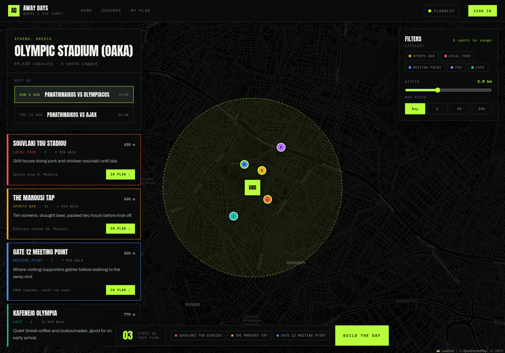
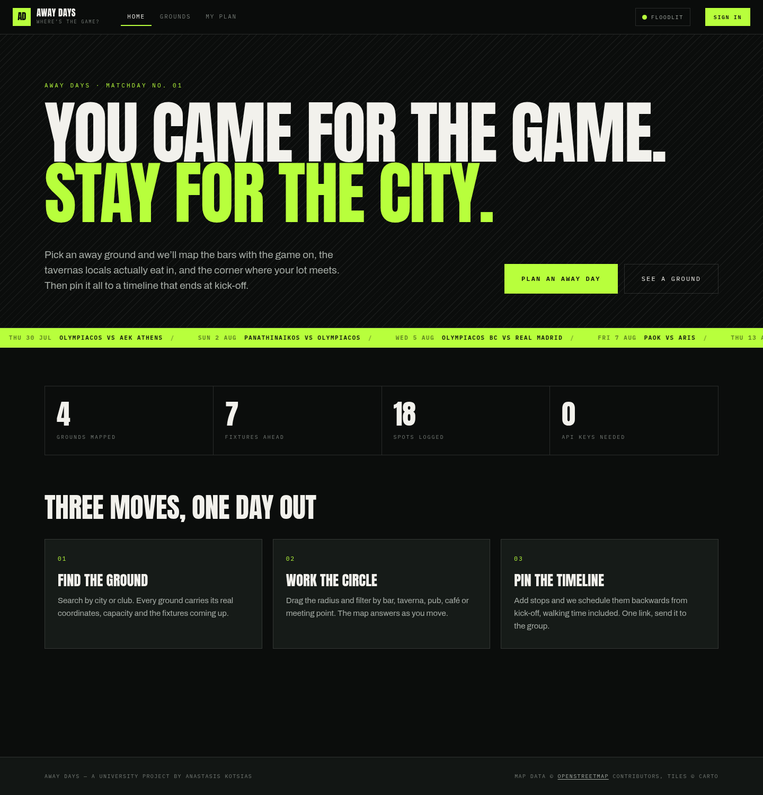
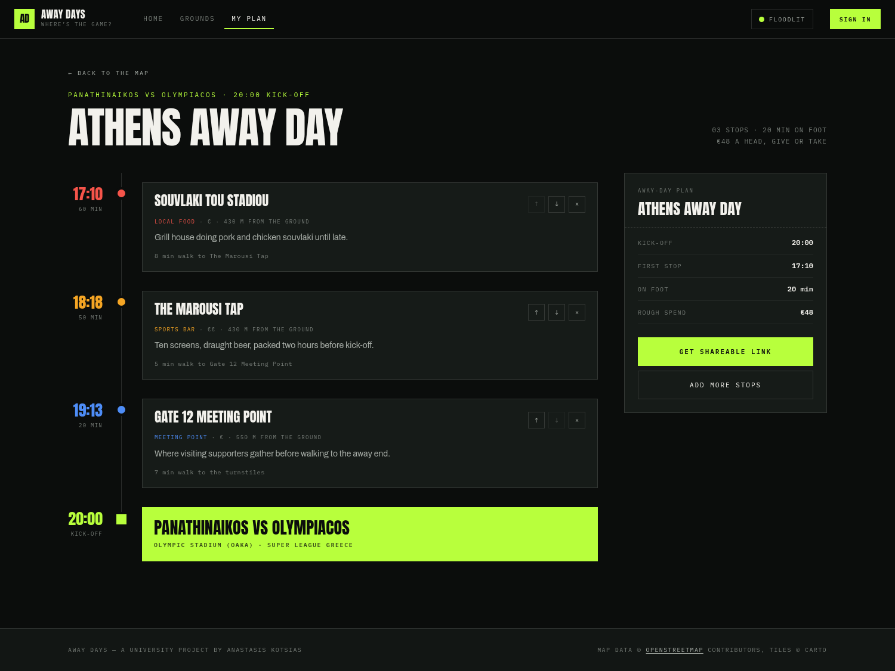

# Away Days — "Where's the Game?"

A full-stack web app for travelling sports fans. Pick an away game, see the ground on a
map, and discover the sports bars, local food spots and fan meeting points around it —
then build and share your own away-day itinerary.

Built as a university project by [Anastasis Kotsias](https://github.com/AnastKotsias).



<details>
<summary>More screens</summary>

**Landing**


**Itinerary builder** — stops scheduled backwards from kick-off


</details>

## Tech stack

| Layer    | Choice                                                    |
| -------- | --------------------------------------------------------- |
| Frontend | React + TypeScript, Vite, Tailwind CSS, TanStack Query     |
| Maps     | React-Leaflet, CARTO basemaps over OpenStreetMap data (free, no API key) |
| Backend  | Node.js + Express, TypeScript, Zod validation              |
| Database | PostgreSQL (Docker), Prisma ORM                            |
| Auth     | JWT + bcrypt *(planned — phase 4)*                         |

The interface is a brutalist, editorial direction: Anton for display, Archivo for
body text, IBM Plex Mono for labels, acid green on near-black, square corners
throughout. It ships in **dark and light**, switched from the header.

## Repository layout

```
awaydays/
├── server/              Express + Prisma REST API
│   ├── prisma/          schema and migrations
│   └── src/
│       ├── routes/      one file per resource
│       ├── lib/         geo maths and API response shapes
│       └── middleware/  error handling
├── client/              Vite + React single-page app
│   └── src/
│       ├── api/         typed fetch client and query hooks
│       ├── components/  map, lists, filters, itinerary dock
│       ├── pages/       one file per route
│       ├── plan/        itinerary state, timeline maths, share links
│       └── theme/       dark/light switching
└── docker-compose.yml   local PostgreSQL
```

## Screens

| Route                   | What it is                                          |
| ----------------------- | --------------------------------------------------- |
| `/`                     | Landing — fixtures marquee, stats                   |
| `/grounds`              | Browse and search grounds                           |
| `/stadiums/:slug`       | The map: fixtures, nearby spots, filters, itinerary |
| `/stadiums/:slug/plan`  | Itinerary builder                                   |
| `/p/:token`             | A shared itinerary, read-only                       |
| `/signin`               | Members' gate *(presentation only — phase 4)*       |

## Getting started

Requirements: Node.js 20+, Docker.

```bash
# 1. Start the database (PostgreSQL on port 5433)
docker compose up -d

# 2. Backend
cd server
cp .env.example .env
npm install
npx prisma migrate dev     # create the tables
npm run db:seed            # load 4 grounds, 7 fixtures, 18 spots
npm run dev                # http://localhost:4000

# 3. Frontend (in a second terminal)
cd client
cp .env.example .env
npm install
npm run dev                # http://localhost:5173
```

### Useful commands

| Where    | Command             | Does                                          |
| -------- | ------------------- | --------------------------------------------- |
| `server` | `npm run dev`       | API with hot reload                           |
| `server` | `npm run db:studio` | browse the database in a GUI                  |
| `server` | `npm run db:reset`  | drop, re-migrate and re-seed                  |
| `server` | `npm run typecheck` | type-check without building                   |
| `client` | `npm run dev`       | Vite dev server                               |
| `client` | `npm run build`     | type-check and produce a production bundle    |

## API

All responses are wrapped in `{ "data": ... }`, with `meta` where extra context helps.
Invalid input returns `400` with the offending field named.

| Method | Path                          | Query parameters                            |
| ------ | ----------------------------- | ------------------------------------------- |
| GET    | `/api/health`                 | —                                           |
| GET    | `/api/stadiums`               | `city`, `q`                                 |
| GET    | `/api/stadiums/:slug`         | —                                           |
| GET    | `/api/stadiums/:slug/spots`   | `category`, `radius`, `maxPrice`, `limit`   |
| GET    | `/api/events`                 | `sport`, `stadium`, `upcoming`, `limit`     |
| GET    | `/api/events/:id`             | —                                           |

Example:

```bash
curl "http://localhost:4000/api/stadiums/oaka/spots?category=SPORTS_BAR,PUB&radius=1500&maxPrice=2"
```

### How the radius search works

Finding "everything within 2 km" happens in two steps:

1. PostgreSQL filters on a **bounding box** — plain `BETWEEN` comparisons on latitude and
   longitude, which can use an index.
2. Node then computes the exact **great-circle distance** (haversine) and drops anything
   inside the rectangle but outside the circle.

Haversine cannot run inside an indexed query, so the database would otherwise have to
evaluate it for every row in the table. The box is index-friendly and deliberately a
little too generous, so it never misses a result; the precise pass cleans up the corners.
See [`server/src/lib/geo.ts`](server/src/lib/geo.ts).

## Data

The stadiums, their coordinates, capacities and leagues are real. The bars, tavernas and
meeting points in the seed are **invented sample data**, placed at realistic walking
distances around each ground so the map and itinerary features can be built and demoed
without a paid places API.

### How the itinerary is scheduled

Stops are timed **backwards from kick-off**, because the question worth answering
is "what time do I have to leave", not "how long will this take". Every stay plus
every walking leg is subtracted from kick-off (less 20 minutes to reach the
turnstiles), and the first stop lands on whatever time is left.

Walking legs are measured point-to-point with haversine rather than from each
spot's distance to the ground — two spots 400 m out on opposite sides are 800 m
apart, and the times should say so. See
[`client/src/plan/timeline.ts`](client/src/plan/timeline.ts).

## Roadmap

- [x] **Phase 1** — Database schema, seed data, REST API
- [x] **Phase 2** — Map view with stadiums, fixtures and filtered nearby spots
- [x] **Phase 3a** — Itinerary builder and shareable links, client-side
- [ ] **Phase 3b** — Persist itineraries through the API
- [ ] **Phase 4** — Authentication, spot reviews, deployment

The `Itinerary`, `ItineraryItem`, `User` and `SpotReview` tables already exist in the
schema, so what remains is endpoints and wiring, not migrations.

Until those endpoints exist, itineraries live in `localStorage` and a share link
carries its whole payload in the URL — so a link genuinely opens on someone
else's phone, at the cost of being long and impossible to revoke. Both are
replaced by `Itinerary.shareId` in phase 3b.
